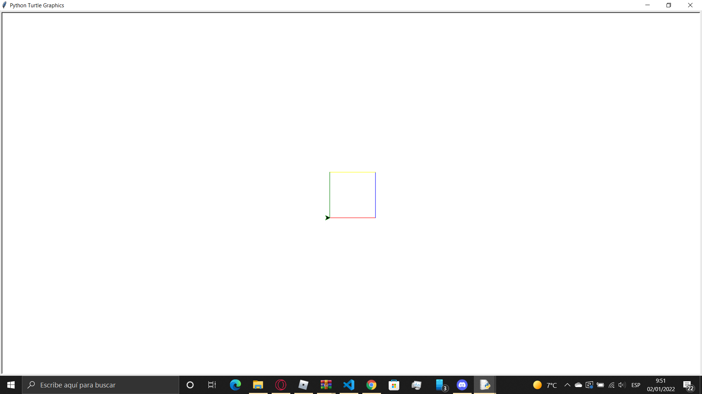
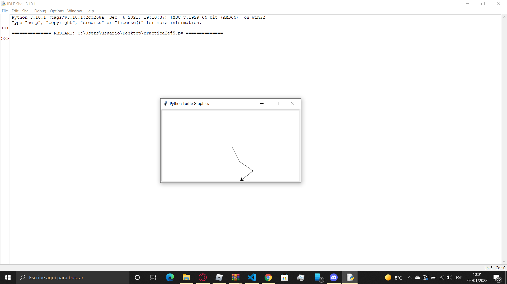
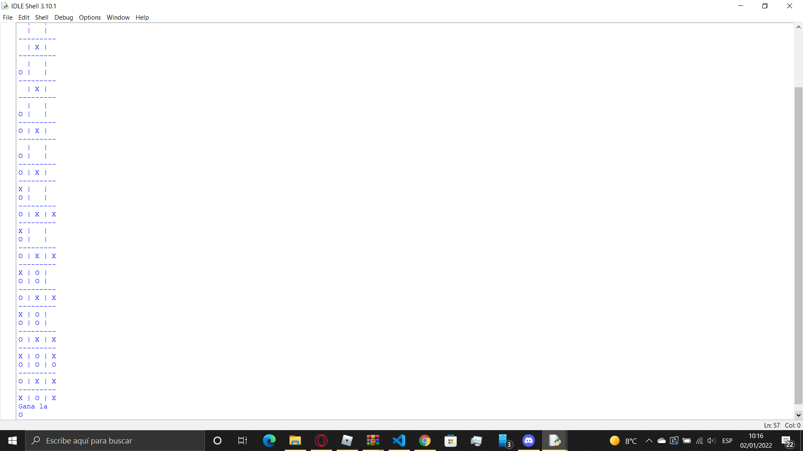
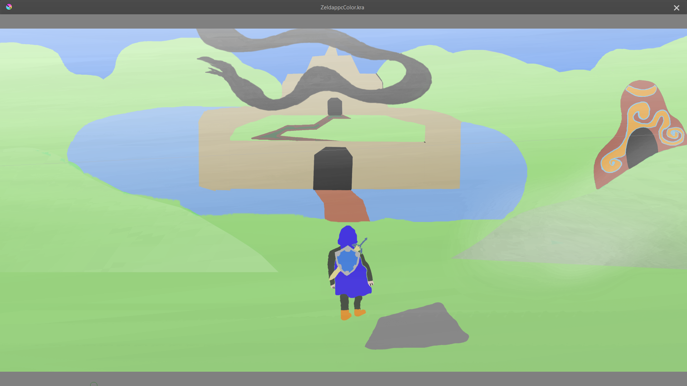

<!DOCTYPE HTML>
<!--
	Massively by HTML5 UP
	html5up.net | @ajlkn
	Free for personal and commercial use under the CCA 3.0 license (html5up.net/license)
-->
<html>
	<head>
		<title>Massively by HTML5 UP</title>
		<meta charset="utf-8" />
		<meta name="viewport" content="width=device-width, initial-scale=1, user-scalable=no" />
		<link rel="stylesheet" href="assets/css/main.css" />
		<noscript><link rel="stylesheet" href="assets/css/noscript.css" /></noscript>
	</head>
	<body class="is-preload">

		<!-- Wrapper -->
			

				<!-- Intro -->
					

						<h1>Alejandro 
						Aguilar Vernia</h1>
						
Un trabajo hecho para mostrar mis trabajos.

						
						<ul class="actions">
							<li><a href="#header" class="button icon solid solo fa-arrow-down scrolly">Continue</a></li>
						</ul>
					

				<!-- Header -->
					<header id="header">
						
					</header>

				

				<!-- Main -->
					

						<!-- Featured Post -->
							<article class="post featured">
								<header class="major">
									Diciembre 26, 2021
									<h2>Sobre mi 
									</h2>
									
Soy un joven universitario de 18 años que vive en la ciudad de Castellón de la Plana. 
									Desde pequeño me ha gustado la tecnología y el ámbito de los videojuegos, el cual estoy estudiando actualmente en la universidad Jaume I. 
									

								</header>
								
								
							</article>

						<!-- Posts -->
							<section class="posts">
								<article>
									<header>
										Diembre 27, 2021
										<h2><a href="#">Programación I 
										Turtle: Cuadrado multicolor</a></h2>
									</header>
									
									
En este trabajo realice mediante Turtle en python un cuadrado en el que los lados cambian de color cada vez que la "tortuga" pasa sobre estos.

									
								</article>
								<article>
									<header>
										Diciembre 27, 2021
										<h2><a href="#">Programación I 
										Turtle:Pirata borracho</a></h2>
									</header>
									
									
En esta práctica hice que la "tortuga" avanzara con rumbo aleatorio hasta que se saliera de la pantalla, de ahí el nombre de pirata borracho.

									
								</article>
								<article>
									<header>
										Enero 2, 2022
										<h2><a href="#">Programación I 
										Pygame:Tres en raya</a></h2>
									</header>
									
									
En esta práctica he realizado el juego de las tres en raya. El código esta formado por muchas funciones definidas entre mucos bucles if, while y for.

									
								</article>
								<article>
									<header>
										Enero 2, 2022
										<h2><a href="#">PPC: 
										Fanart de Breath Of The Wild</a></h2>
									</header>
									
									
Esta es una de las ilustraciones del PPc. Para esta en concreto me tarde dos días enteros para hacerla. Estoy orgulloso del resultado final.

									
								</article>
								
							</section>

						

					

				

		<!-- Scripts -->
			
			
			
			
			
			
			

	</body>
</html>
 
